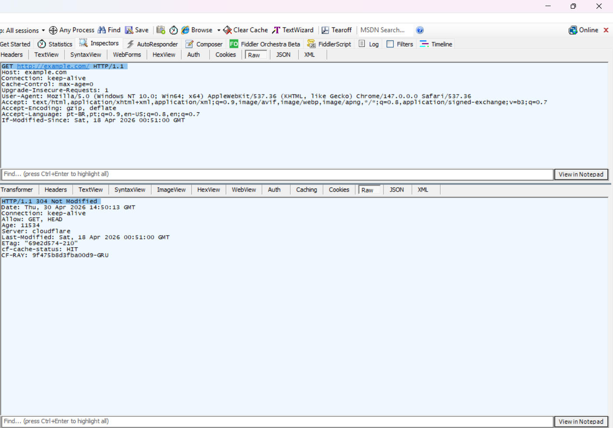
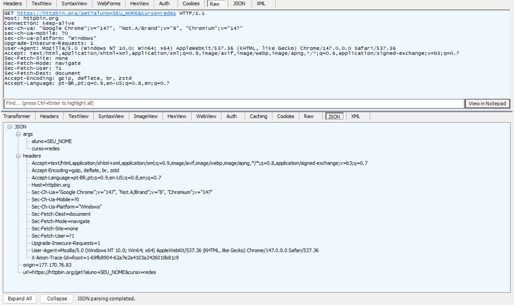
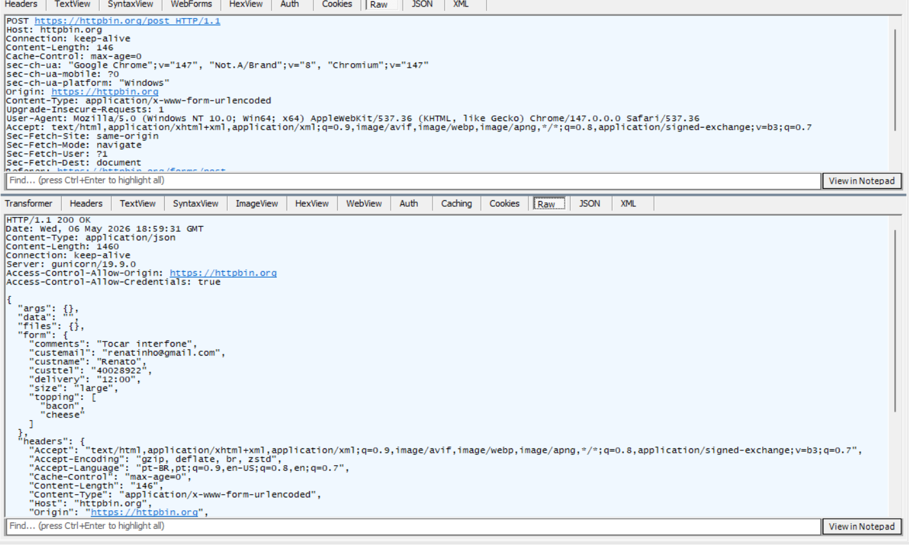
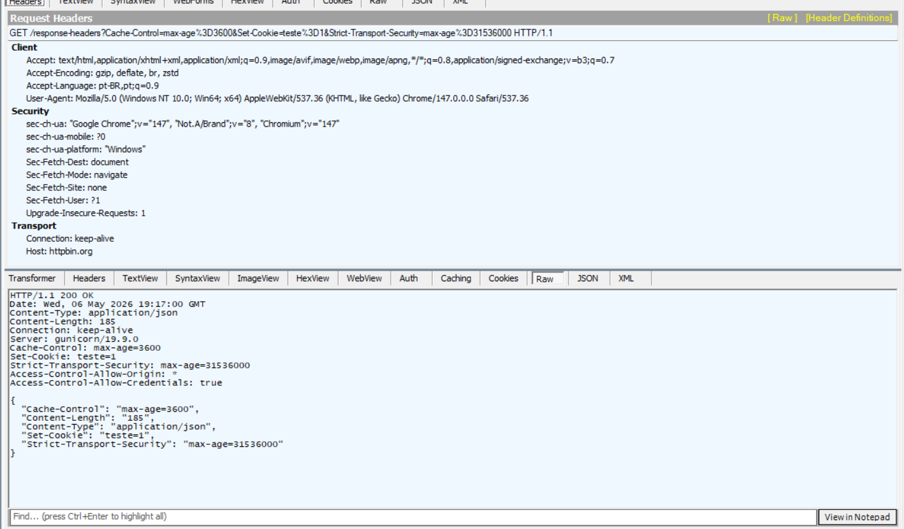
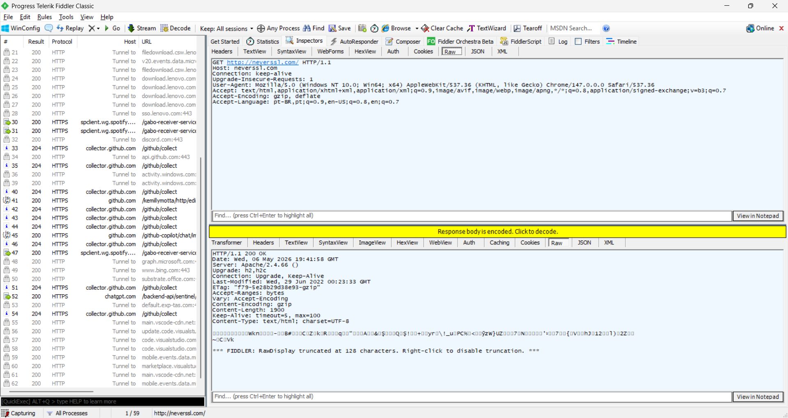
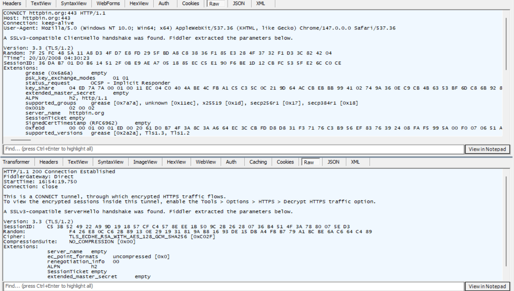
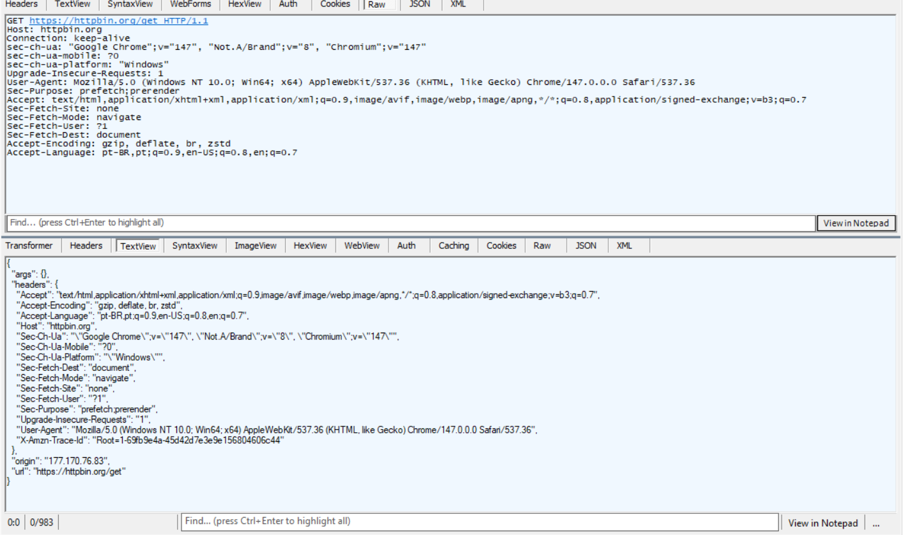
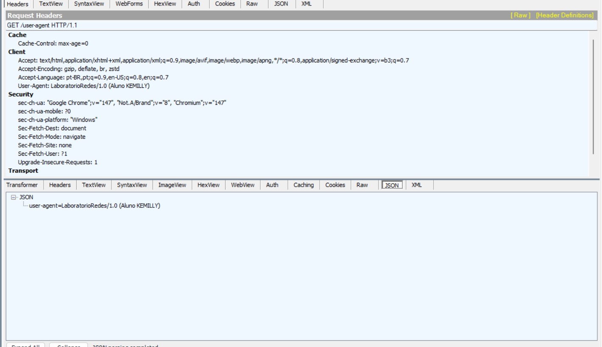
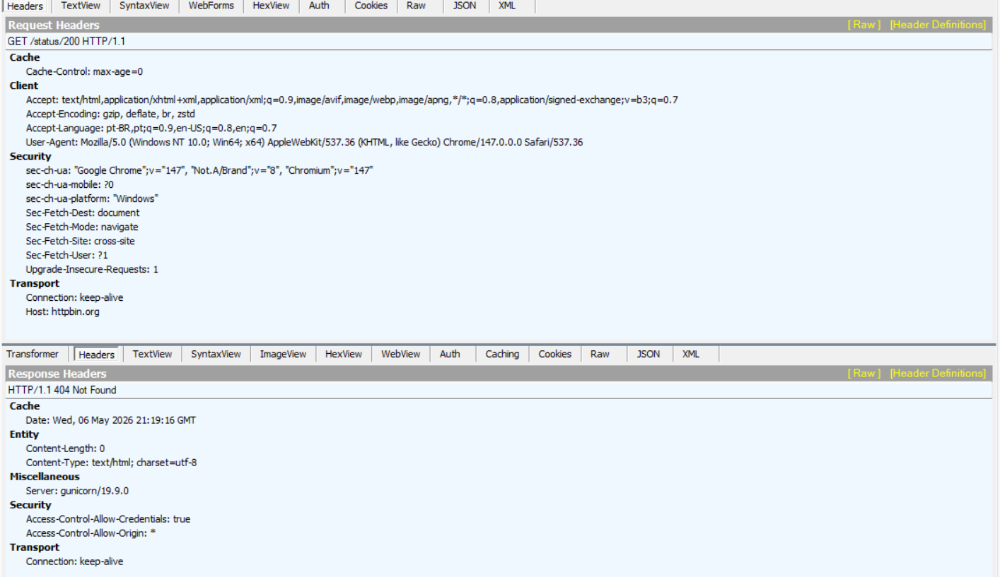

# Relatório — Laboratório de Inspeção HTTP/HTTPS — Fluxo A (Administrador)

> **Como usar este template:** substitua os campos `[...]` pelas suas respostas,
> anexe as capturas de tela na pasta `evidencias/` e referencie-as onde indicado.
> Preserve a formatação markdown (tabelas, blocos de código) para facilitar a correção.

---

## Identificação

| Campo       | Valor                  |
|-------------|------------------------|
| Nome        | Kemilly Cristina de Oliveira Motta    |
| Nome        | Renato Teixeira Martins Junior    |
| Disciplina  | Redes de Computadores  |
| Turma       | SI/2            |
| Data        | 30/04   |
| Fluxo       | **A — Aluno com privilégio de administrador** |
| SO utilizado | [Windows 11 / Ubuntu 22.04 / macOS ...] |
| Ferramenta de proxy | [Fiddler Classic / mitmproxy / HTTP Toolkit / ...] |
| Navegador(es)       | [Chrome 124 / Firefox 125 / ...] |

---

## Atividade 1 — Primeira captura

**Captura de tela:** 


**Request-line enviada:**

```http
[GET http://example.com/ HTTP/1.1]
```

**Status-line recebida:**

```http
[HTTP/1.1 304 Not Modified]
```

### Pergunta 1.1
> Quantos cabeçalhos o navegador enviou no request? Liste-os.

**Resposta:**
[8]

Cabeçalhos:
- [Host: example.com]
- [Connection: keep-alive]
- [Upgrade-Insecure-Requests: 1]
- [User-Agent: Mozilla/5.0 (Windows NT 10.0; Win64; x64) AppleWebKit/537.36 (KHTML, like Gecko) Chrome/147.0.0.0 Safari/537.36]
- [Accept: text/html,application/xhtml+xml,application/xml;q=0.9,image/avif,image/webp,image/apng,*/*;q=0.8,application/signed-exchange;v=b3;q=0.7]
- [Accept-Encoding: gzip, deflate]
- [Accept-Language: pt-BR,pt;q=0.9,en-US;q=0.8,en;q=0.7]
- [If-Modified-Since: Wed, 06 May 2026 14:21:37 GMT]

### Pergunta 1.2
> Qual foi o `Content-Length` da resposta? Se ele não apareceu, registre `Transfer-Encoding`, versão do protocolo ou outro indício observado. O corpo retornado é HTML, texto puro, JSON ou binário? Como você descobriu?

**Resposta:** [O servidor respondeu com 304 Not Modified, indicando que o recurso não foi alterado e, por isso, não há corpo na resposta nem cabeçalhos como Content-Length ou Transfer-Encoding, o que é esperado nesse caso. O servidor é o Cloudflare (CF-Cache-Status: HIT) e o Last-Modified coincide com o valor enviado pelo cliente, confirmando que o conteúdo permanece igual, enquanto o ETag ("69fb4e71-210") indica um recurso estático pequeno compatível com a página padrão do site. Assim, nenhum dado foi retransmitido e o navegador reutilizou o cache, sendo possível inferir que o conteúdo original seria HTML.]

---

## Atividade 2 — Anatomia de um GET



**Request-line completa:**

```http
[GET https://httpbin.org/get?aluno=SEU_NOME&curso=redes HTTP/1.1]
```

**Cabeçalhos-chave capturados:**

| Cabeçalho    | Valor                    |
|--------------|--------------------------|
| `Host`       | [httpbin.org]                    |
| `User-Agent` | [Mozilla/5.0 (Windows NT 10.0; Win64; x64) AppleWebKit/537.36 (KHTML, like Gecko) Chrome/147.0.0.0 Safari/537.36]                    |
| `Accept`     | [text/html,application/xhtml+xml,application/xml;q=0.9,image/avif,image/webp,image/apng,*/*;q=0.8,application/signed-exchange;v=b3;q=0.7]                    |

**Campos do JSON de resposta:**

```json
{
  "args":    [aluno=SEU_NOME, curso=redes],
  "headers": [Accept, Accept-Encoding, Accept-Language, Host, Sec-Ch-Ua, Sec-Ch-Ua-Mobile, Sec-Ch-Ua-Platform, Sec-Fetch-Dest, Sec-Fetch-Mode, Sec-Fetch-Site, Sec-Fetch-User, Upgrade-Insecure-Requests, User-Agent, X-Amzn-Trace-Id],
  "origin":  [177.170.76.83]
}
```

### Pergunta 2.1
> O valor do campo `origin` corresponde a qual elemento da rede? Por que normalmente não é o IP local?

**Resposta:** [O campo origin representa o IP público da conexão, ou seja, o endereço que o servidor enxerga na internet. Esse IP geralmente é do roteador (gateway da rede), e não do dispositivo, porque o NAT substitui o IP privado (como 192.168.x.x) pelo IP público ao enviar a requisição. Assim, o servidor vê apenas o IP externo, não o interno.]

### Pergunta 2.2
> Compare o `User-Agent` enviado com o que aparece no JSON da resposta. Coincidem?

**Resposta:** [Sim, são idênticos. Isso era esperado, pois o httpbin.org funciona como um espelho, ele simplesmente devolve no JSON exatamente os cabeçalhos que recebeu. Isso confirma que o Fiddler capturou o request com fidelidade e que nenhum intermediário alterou o cabeçalho User-Agent durante o trajeto.]

### Pergunta 2.3
> Em `https://httpbin.org/headers`, liste até três cabeçalhos que o servidor vê mas **não aparecem** no Raw do request. De onde vêm? Se não encontrar três, explique por que o resultado pode variar.

**Resposta:**

| Cabeçalho visto pelo servidor | Origem provável | Observação |
|-------------------------------|-----------------|------------|
| [X-Amzn-Trace-Id]                         | [Infraestrutura AWS/CDN intermediária]           | [Adicionado automaticamente por um proxy ou load balancer da Amazon no caminho até o servidor, invisível no Raw do Fiddler]      |
| [Sec-Ch-Ua]                         | [Navegador (Chrome)]           | [Cabeçalho moderno de Client Hints; pode não aparecer no Raw dependendo da versão do Fiddler, mas o servidor o recebe]      |
| [Sec-Ch-Ua-Platform]                         | [Navegador (Chrome)]           | [Também um Client Hint gerado automaticamente pelo Chrome; indica o SO da máquina ("Windows"), nem sempre exibido no Raw]      |

---

## Atividade 3 — POST e envio de formulário



**Request-line do POST:**

```http
[POST https://httpbin.org/post HTTP/1.1]
```

**Cabeçalhos do request:**

| Cabeçalho        | Valor |
|------------------|-------|
| `Content-Type`   | [application/x-www-form-urlencoded] |
| `Content-Length` | [146] |

**Corpo completo do request:**

```
[comments=Tocar+interfone&custemail=renatinho%40gmail.com&custname=Renato
&custtel=40028922&delivery=12%3A00&size=large&topping=bacon&topping=cheese]
```

**Trecho do JSON de resposta (campo `form`):**

```json
"form": {
  "comments": "Tocar interfone",
  "custemail": "renatinho@gmail.com",
  "custname": "Renato",
  "custtel": "40028922",
  "delivery": "12:00",
  "size": "large",
  "topping": ["bacon", "cheese"]
}
```

### Pergunta 3.1
> Qual o formato do corpo? Como esse formato codifica caracteres especiais (espaço, acentos)?

**Resposta:** [O corpo está no formato application/x-www-form-urlencoded. Nesse formato, os dados são enviados como pares chave=valor (ex: nome=Renato&mensagem=Ola+Mundo). Caracteres especiais são codificados por URL encoding, onde espaços viram + ou %20, e acentos ou outros caracteres são convertidos para sua representação em hexadecimal (ex: á → %C3%A1).]

### Pergunta 3.2
> Comparando **Request → WebForms** e **Request → Raw**: qual das duas corresponde literalmente aos bytes enviados no socket TCP?

**Resposta:** [A visualização Request → Raw é a que corresponde literalmente aos bytes enviados no socket TCP, pois mostra a requisição exatamente como foi transmitida. Já o WebForms é apenas uma representação interpretada e organizada dos dados, facilitando a leitura, mas não refletindo fielmente o formato bruto enviado.]

### Pergunta 3.3 — Composer

**LINK NÃO FUNCIONOU**

---

## Atividade 5 — Identificação de cabeçalhos



| Cabeçalho                    | Req/Resp | Valor capturado | Função em uma frase |
|------------------------------|----------|------------------|----------------------|
| `Host`                       | [Request]    | [httpbin.org]            | [Identifica o servidor de destino da requisição]                |
| `User-Agent`                 | [Request]    | [Mozilla/5.0 (Windows NT 10.0; Win64; x64) Chrome/147.0.0.0]            | [Informa ao servidor qual navegador e SO está fazendo a requisição]                |
| `Accept`                     | [Request]    | [text/html, application/xhtml+xml, application/xml;q=0.9...]            | [Informa os tipos de conteúdo que o cliente aceita receber]                |
| `Accept-Encoding`            | [Request]    | [gzip, deflate, br, zstd]            | [Informa os algoritmos de compressão que o cliente suporta]                |
| `Cookie`                     | [Request]    | [ausente — cookie ainda não existia no momento do request]            | [Envia cookies armazenados ao servidor para manter sessão/estado]                |
| `Server`                     | [Response]    | [gunicorn/19.9.0]            | [Identifica o software do servidor que processou a requisição]                |
| `Content-Type`               | [Response]    | [application/json]            | [Informa o formato do corpo da resposta]                |
| `Content-Encoding`           | [Response]    | [ausente]            | [Indica a compressão aplicada ao corpo da resposta]                |
| `Set-Cookie`                 | [Response]    | [teste=1]            | [Instrui o navegador a armazenar um cookie para uso futuro]                |
| `Cache-Control`              | [Response]    | [max-age=3600]            | [Define por quanto tempo o recurso pode ser armazenado em cache]                |
| `Strict-Transport-Security`  | [Response]    | [max-age=31536000]            | [Força o navegador a usar HTTPS por 1 ano nesse domínio]                |

### Pergunta 5.1
> `Content-Encoding: gzip`/`br` apareceu? Compare `Content-Length`, quando presente, com o conteúdo visível. O que explica a diferença?

**Resposta:** [Não apareceu Content-Encoding: gzip ou br, pois o corpo da resposta é pequeno (185 bytes) e não precisou ser comprimido. O Content-Length bate com o tamanho do conteúdo visível, já que não houve compressão. Se houvesse gzip ou br, o valor de Content-Length representaria o tamanho comprimido (menor), enquanto o conteúdo exibido após descompressão seria maior, explicando a diferença.]

### Pergunta 5.2
> Cliente envia `Accept: application/json` mas o recurso só existe em `text/html`. Qual status code esperar?

**Resposta:** [Se o cliente envia Accept: application/json, ele está dizendo que só aceita JSON. Se o servidor não tiver esse formato (por exemplo, só tiver text/html), o comportamento correto seria retornar 406 Not Acceptable. Resumindo, se o servidor tem o formato pedido retorna 200 OK, se não tem retorna 406, e se o recurso nem existe retorna 404 Not Found. Na prática, porém, muitos servidores ignoram o Accept e respondem 200 OK com HTML mesmo assim.]

### Pergunta 5.3
> `Strict-Transport-Security` apareceu? Qual seu papel contra downgrades para HTTP puro?

**Resposta:** [Sim, o cabeçalho Strict-Transport-Security: max-age=31536000 apareceu e indica que o navegador deve acessar o site apenas via HTTPS por 1 ano. Isso impede ataques de downgrade, como o SSL Strip, porque o navegador passa a converter automaticamente qualquer tentativa de acesso HTTP para HTTPS antes mesmo de fazer a requisição, garantindo uma conexão segura.]

---

## Atividade 6 — HTTP vs HTTPS

**Captura de tela HTTP (neverssl.com):**


**Captura de tela HTTPS sem decriptação (https://httpbin.org/get):**


**Captura de tela HTTPS com decriptação (https://httpbin.org/get):**


### Pergunta 6.1
> No `https://httpbin.org/get` sem decriptação, que método aparece? O que ele faz e por que existe?

**Resposta:** [Sem decriptação ativada, o Fiddler mostra apenas o método CONNECT, que cria um túnel TCP criptografado até o servidor. O GET real fica dentro desse túnel e não pode ser visualizado. Esse método existe para permitir que proxies transportem HTTPS sem quebrar a criptografia, funcionando como um canal transparente. A resposta 200 Connection Established confirma que o túnel foi criado com sucesso.]

### Pergunta 6.2
> Com decriptação desabilitada, o que ainda é visível no HTTPS e o que está oculto?

**Resposta (visível):** [Domínio de destino (httpbin.org:443), porta (443), tamanho do tráfego (bytes enviados e recebidos), versão do TLS (1.2), cipher suite negociado e tempo de conexão.]
**Resposta (oculto):** [Método HTTP real (GET), URL completa (/get), cabeçalhos, corpo da requisição e resposta, status code e cookies.]

### Pergunta 6.3
> O que muda quando a decriptação é ativada? Que dados passam a ser inspecionáveis?

**Resposta:** [Com a decriptação ativada, o Fiddler deixa de mostrar só o CONNECT e passa a exibir toda a requisição real: método GET, URL completa, cabeçalhos, corpo em JSON, status 200 OK e o IP de origem. Antes, sem decriptação, era visível apenas o túnel (CONNECT, domínio e porta); depois, todo o conteúdo HTTP que estava criptografado passa a ser acessível.]

### Pergunta 6.4
> Por que a técnica do Fiddler **não** funcionaria contra você se um atacante a tentasse sem instalar o certificado?

**Resposta:** [Sem o certificado do Fiddler instalado, a interceptação não funciona porque o navegador não confia no certificado apresentado. O Fiddler atua como um intermediário (MitM), gerando certificados para decriptar o tráfego, mas isso só é aceito porque seu certificado raiz foi instalado e confiado no sistema. Sem isso, o navegador detecta que a autoridade não é válida e bloqueia a conexão com erro como NET::ERR_CERT_AUTHORITY_INVALID, impedindo qualquer acesso aos dados. Em resumo, só funciona porque o certificado foi explicitamente confiado; um atacante externo não consegue fazer isso.]

---

## Atividade 8 — Manipulação com breakpoints

**Captura de tela da edição do User-Agent:** 


**JSON de resposta após edição:**

```json
{
  "user-agent": "LaboratorioRedes/1.0 (Aluno KEMILLY)"
}
```

### Pergunta 8.1
> O servidor pode detectar que o `User-Agent` foi forjado? Discuta.

**Resposta:** [Não, o servidor não consegue ter certeza. O User-Agent é só um texto enviado pelo cliente e pode ser facilmente falsificado. O servidor pode até suspeitar comparando alguns sinais, mas não tem como confirmar com segurança.]

### Pergunta 8.2
> Após editar a status-line de `200 OK` para `404 Not Found`, o que o navegador exibe? Comente o papel do proxy como MITM.

**Captura de tela:** 


**Resposta:** [O navegador exibiu erro 404 Not Found após a resposta ser alterada no Fiddler, mesmo que o servidor tivesse enviado 200 OK. Isso mostra que o proxy, atuando como intermediário, conseguiu modificar a resposta no caminho, fazendo o navegador interpretar o recurso como inexistente. O corpo da resposta continuou igual, mas o status alterado prevaleceu. Conclusão: um proxy MITM pode modificar status, cabeçalhos ou conteúdo sem o servidor perceber, e é justamente o TLS com verificação de certificado que impede esse tipo de manipulação não autorizada.]

### Pergunta 8.3
> Confirme que todos os breakpoints foram desabilitados.

- [x] Breakpoints desabilitados ao final (Shift+F11)

---

## Questões de Verificação

### 1. Ordem dos elementos em uma mensagem HTTP/1.1. O que separa cabeçalhos do corpo?

[Request-line (ou status-line) → cabeçalhos → linha em branco (\r\n\r\n) → corpo. A linha em branco é o separador.]

### 2. Por que `Host` é obrigatório em HTTP/1.1 mas era opcional em HTTP/1.0?

[Em HTTP/1.1 um mesmo servidor pode hospedar vários domínios (virtual hosting). Sem o Host, o servidor não saberia qual site entregar.]

### 3. Diferença entre `401 Unauthorized` e `403 Forbidden`.

[401 significa "não autenticado — faça login". 403 significa "autenticado, mas sem permissão — acesso negado".]

### 4. Um `POST` enviado duas vezes produz o mesmo efeito? E um `PUT`? Justifique em termos de idempotência.

[POST não é idempotente — dois envios podem criar dois recursos. PUT é idempotente — enviar duas vezes substitui pelo mesmo resultado.]

### 5. Por que HTTPS permite ainda que um observador saiba qual site está sendo visitado? (SNI, DNS)

[O DNS resolve o domínio em texto puro antes da conexão, e o SNI (Server Name Indication) envia o domínio sem criptografia no handshake TLS.]

### 6. O que muda com `Content-Encoding: gzip`? Onde os dados são compactados e descompactados?

[O servidor compacta o corpo antes de enviar; o navegador descompacta ao receber. O Content-Length reflete o tamanho comprimido.]

### 7. Impacto prático de `Cache-Control: no-store`.

[O navegador nunca armazena a resposta em cache — cada acesso gera uma nova requisição ao servidor, útil para dados sensíveis.]

### 8. Como o Fiddler decifra HTTPS sem violar a criptografia, e por que exige cooperação do usuário?

[Instala um certificado raiz próprio no SO do usuário, agindo como MITM autorizado. Por isso exige cooperação — sem o certificado instalado, o navegador recusa a conexão.]

### 9. Exemplo de cabeçalho de request que o navegador envia automaticamente, sem a página pedir.

[User-Agent — o navegador o envia em toda requisição sem que a página solicite, identificando o cliente ao servidor.]

### 10. Se fosse automatizar a inspeção via script, qual ferramenta alternativa escolheria? Por quê?

[mitmproxy — é open source, programável em Python, permite interceptar e modificar tráfego HTTP/HTTPS via script, ideal para automação e testes.]

---

## Reflexão final (opcional, até 10 linhas)

> O que você aprendeu que não conhecia antes deste laboratório? Há algum
> cabeçalho, código de status ou comportamento que passou a olhar com
> mais atenção? Alguma dificuldade que recomendaria evitar para a próxima turma?

[reflexão]

---

## Encerramento — Higiene de segurança (obrigatório no Fluxo A)

**Captura de tela do `certmgr.msc` após remoção do certificado:**


- [x] *Decrypt HTTPS traffic* desabilitado no Fiddler
- [x] Certificado `DO_NOT_TRUST_FiddlerRoot` removido do Windows (`certmgr.msc`)
- [x] Certificado `DO_NOT_TRUST_FiddlerRoot` removido do Firefox (se aplicável)
- [x] Fiddler fechado (porta 8888 liberada)

**Comentário do aluno sobre a importância dessa etapa:**

[explicar, em até 5 linhas, por que manter o certificado instalado é um risco]

---

## Checklist de entrega

- [ ] Todos os campos `[...]` substituídos
- [ ] Pasta `evidencias/` com capturas nomeadas por atividade
- [ ] 10 questões de verificação respondidas
- [ ] Evidência de remoção do certificado anexada
- [ ] Arquivo compactado como `NOME_RA_LAB_HTTP_FLUXOA.zip`
- [ ] Submetido no Microsoft Teams dentro do prazo
